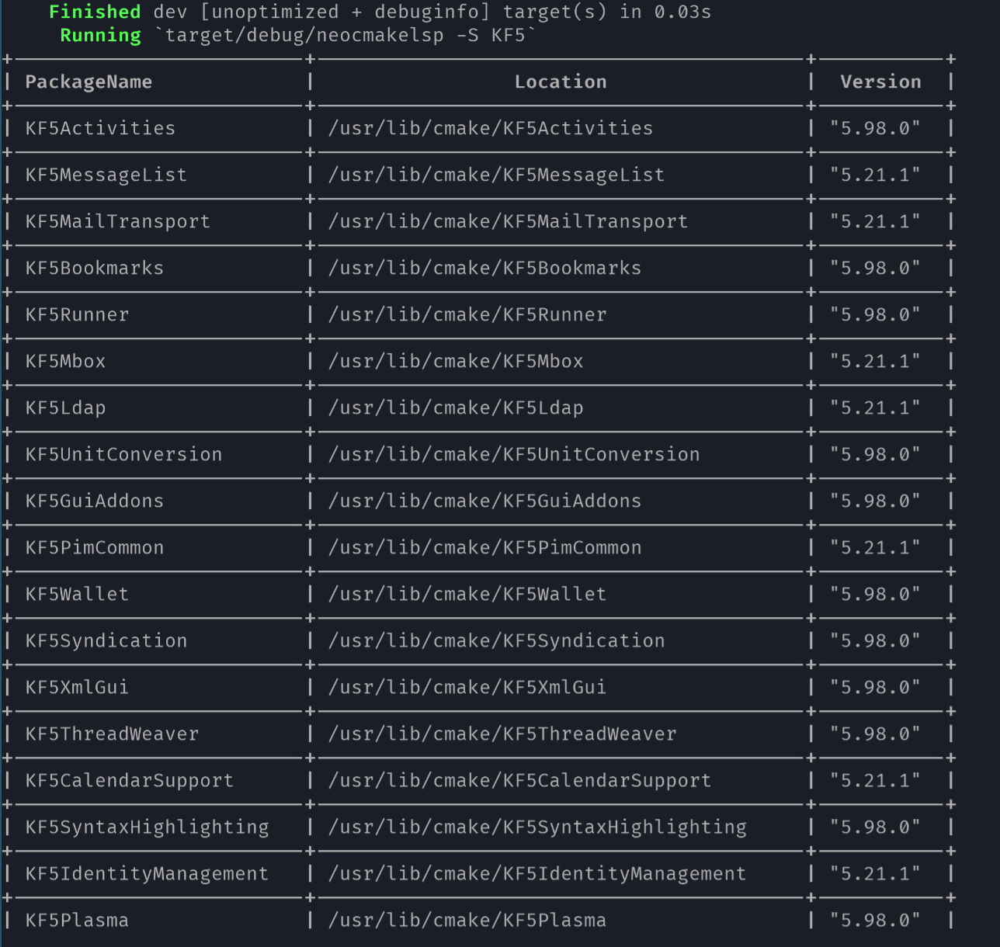
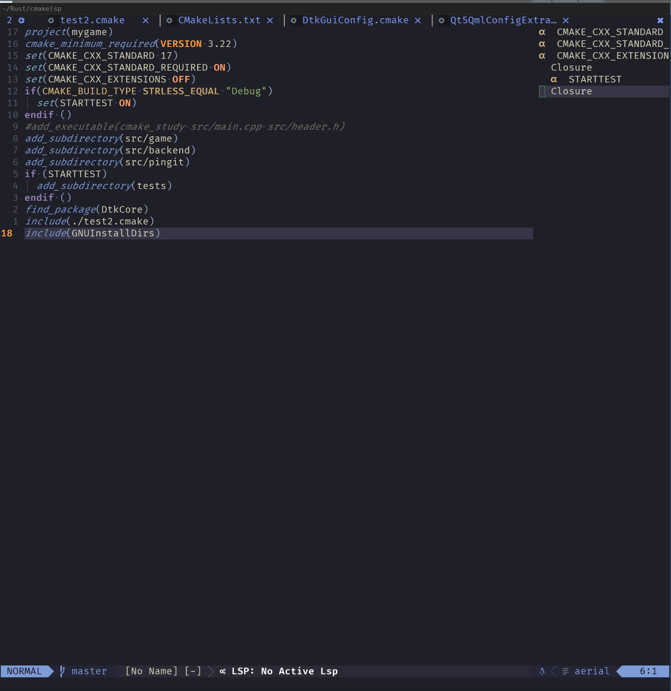
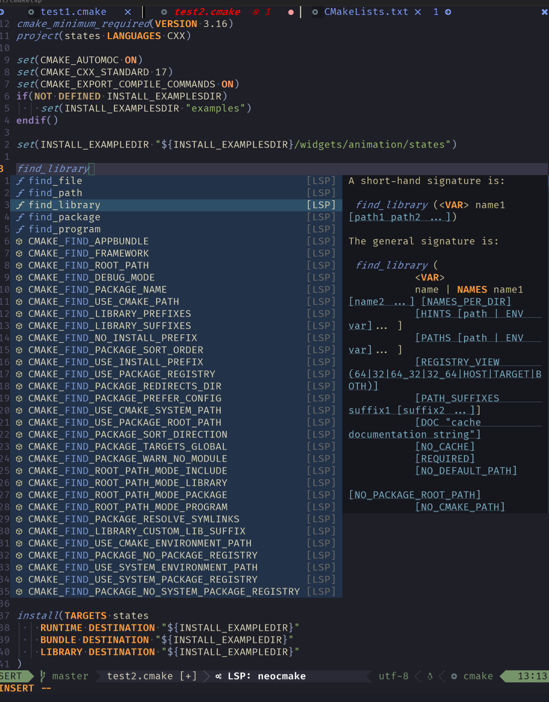
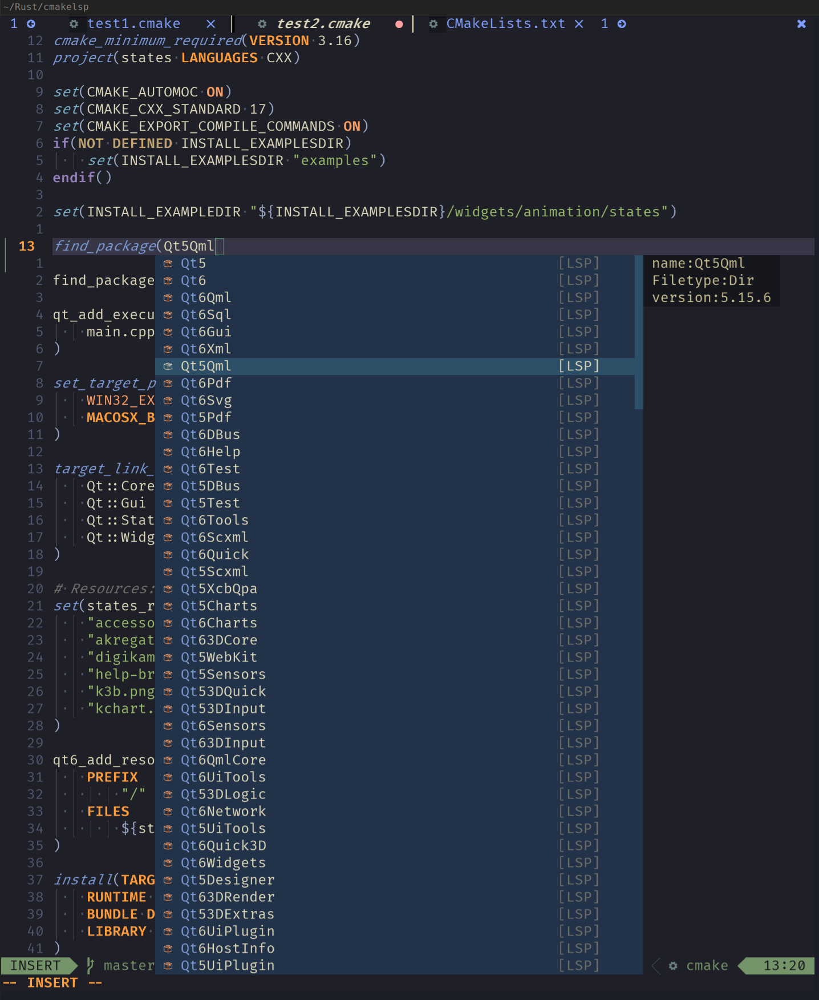
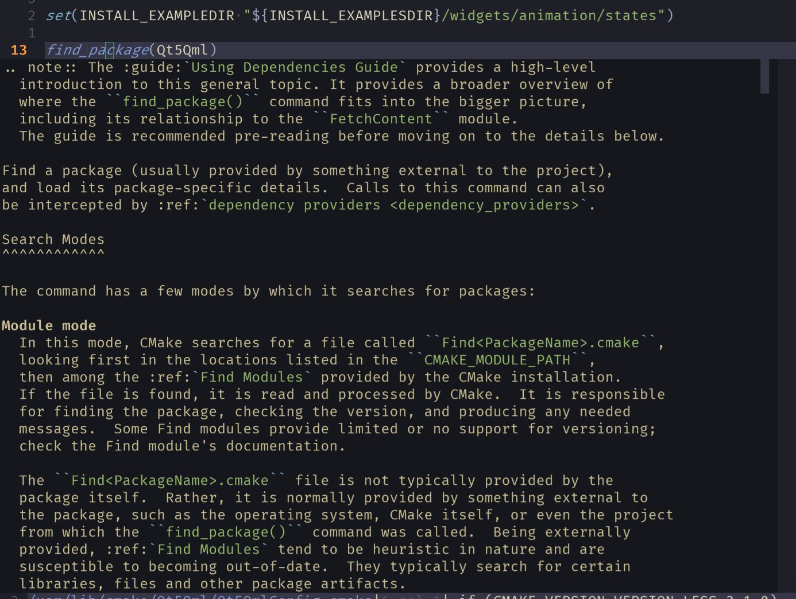
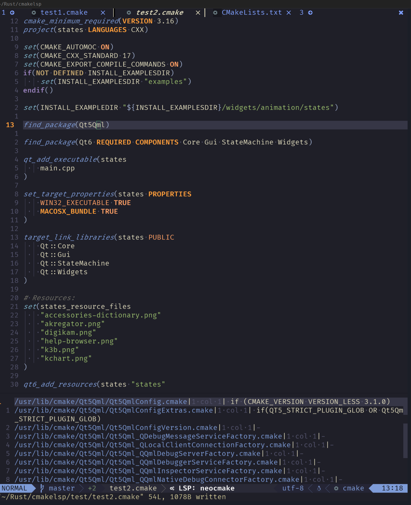
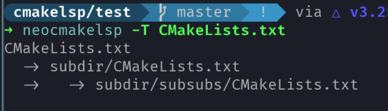

# CMake LSP implementation based on Tower and Tree-sitter

[](https://crates.io/crates/neocmakelsp)
[](https://codecov.io/gh/neocmakelsp/neocmakelsp)

 **Intelligent Code Completion**: Provides precise code completion suggestions by deeply analyzing CMake files, enhancing development efficiency.
- **Real-time Error Detection**: Integrates Linting functionality to check for potential issues in your code, helping maintain code quality.
- **Support for Neovim Emacs VSCode Helix**: Compatible with these popular editors, catering to diverse developer needs.
- **Simple Configuration**: Easy to set up and use, minimizing configuration time so you can focus on development.
- **CLI Tool Integration**: Not only an LSP, but also includes command-line tools for code formatting, making it convenient for different environments.


# Table of Contents

1. [Introduction](#install)
2. [Features](#features)
3. [Installation](#installation)
4. [Editor Support](#editor-support)
   - [Neovim Configuration](#neovim-configuration)
   - [helix Configuration](#helix-configuration)
   - [Emacs Configuration](#emacs-configuration)
5. [Features](#features)
6. [User Feedback](#user-feedback)
   - [macOS Users](#user-feedback)
   - [Windows Users](#user-feedback)
7. [Visual Examples](#visual-examples)


## Install

```bash
cargo install neocmakelsp
```

## Editor Support

### neovim configuration

The config of neocmakelsp is in `nvim-lsp-config`, so just follow `nvim-lsp-config` to setup it

neocmakelsp has two start ways: `stdio` and `Tcp`. `Tcp` is for debug. If you want to help me and debug is , you should start it with `Tcp` way.

#### Stdio

```lua
local configs = require("lspconfig.configs")
local nvim_lsp = require("lspconfig")
if not configs.neocmake then
    configs.neocmake = {
        default_config = {
            cmd = { "neocmakelsp", "--stdio" },
            filetypes = { "cmake" },
            root_dir = function(fname)
                return nvim_lsp.util.find_git_ancestor(fname)
            end,
            single_file_support = true,-- suggested
            on_attach = on_attach, -- on_attach is the on_attach function you defined
            init_options = {
                format = {
                    enable = true
                },
                lint = {
                    enable = true
                },
                scan_cmake_in_package = true -- default is true
            }
        }
    }
    nvim_lsp.neocmake.setup({})
end
```

#### Tcp

```lua
if not configs.neocmake then
    configs.neocmake = {
        default_config = {
            cmd = vim.lsp.rpc.connect('127.0.0.1','9257'),
            filetypes = { "cmake" },
            root_dir = function(fname)
                return nvim_lsp.util.find_git_ancestor(fname)
            end,
            single_file_support = true,-- suggested
            on_attach = on_attach, -- on_attach is the on_attach function you defined
            init_options = {
                format = {
                    enable = true
                }
            }
        }
    }
    nvim_lsp.neocmake.setup({})
end

```

### helix configuration
#### Tcp

```toml
[[language]]
name = "neocmake"
auto-format = true
language-servers = [{ name = "neocmakelsp" }]

[language-server.neocmakelsp]
command = "nc"
args = ["localhost", "9257"]
```
#### Stdio

```toml
[[language]]
name = "cmake"
auto-format = true
language-servers = [{ name = "neocmakelsp" }]

[language-server.neocmakelsp]
command = "neocmakelsp"
args = ["--stdio"]
```

### emacs configuration

To use neocmakelsp with eglot:

``` emacs-lisp
(use-package cmake-ts-mode
  :config
  (add-hook 'cmake-ts-mode-hook
    (defun setup-neocmakelsp ()
      (require 'eglot)
      (add-to-list 'eglot-server-programs `((cmake-ts-mode) . ("neocmakelsp" "--stdio")))
      (eglot-ensure))))
```


## Features

-   watchfile
-   complete
-   symbol_provider
-   On hover
-   Format
-   document_link
-   GO TO Definitation
    -   find_package
    -   include
-   Search cli
-   Get the project struct
-   It is also a cli tool to format
-   Lint

## Lint form 6.0.27

Put a file named `.neocmakelint.toml` under the root of the project.

```toml
command_upcase = "ignore" # "lowercase", "upcase"
```
Then it will check whether the command is all upcase.

### External cmake-lint

When [cmake-lint](https://cmake-format.readthedocs.io/en/latest/cmake-lint.html) is installed, `neocmakelsp` will utilize it to offer linting and code analysis each time the file is saved. This functionality can be enabled or disabled in the `.neocmakelint.toml` file:

```toml
enable_external_cmake_lint = true # true to use external cmake-lint, or false to disable it
```

If `enable_external_cmake_lint` is turned on but `cmake-lint` is not installed, external linting will not report any error message.

### If you want to use watchfile in neovim, set

```lua
capabilities = {
    workspace = {
        didChangeWatchedFiles = {
            dynamicRegistration = true,
            relative_pattern_support = true,
        },

    },

}
```

It will check CMakeCache.txt, and get whether the package is exist

Snippet Support

```lua
capabilities = {
   textDocument = {
       completion = {
           completionItem = {
               snippetSupport = true
           }
       }
   }
}
```

### lsp init_options

```lua
init_options = {
    format = {
        enable = true, -- to use lsp format
    },
    lint = {
        enable = true
    },
    scan_cmake_in_package = false, -- it will deeply check the cmake file which found when search cmake packages.
    semantic_token = false,
    -- semantic_token heighlight. if you use treesitter highlight, it is suggested to set with false. it can be used to make better highlight for vscode which only has textmate highlight
}

```

## TODO

-   Undefined function check

## Visual Examples

### Search



### symbol



### Complete and symbol support




### OnHover



### GoToDefinition




### Tree



### Format cli

_Note: When formatting files, make sure that your .editorconfig file is in your working directory_

```
format the file

Usage: neocmakelsp {format|--format|-F} [OPTIONS] <FormatPath>...

Arguments:
  <FormatPath>...  file or folder to format

Options:
  -o, --override  override
  -h, --help      Print help
```

It will read .editorconfig file to format files, just set like

```ini
[CMakeLists.txt]
indent_style = space
indent_size = 4
```

#### Note

The format do the min things, just do `trim` and place the first line to the right place by the indent you set, this means

```cmake
function(A)

        set(A
        B
            C
        )

    endfunction()
```

it will just become

```cmake

function(A)

    set(A
        B
            C
        )

endfunction()
```

It just remove the space in the end, replace `\t` at the begin of each line to ` `, if set `indent_size` to space, and format the first line to right place. It does little, but I think it is enough.


## User Feedback

* I do not know if all features will work on mac and windows, so if someone use mac or windows, please help me and send pr for this project.
* I want a comaintainer, who is familiar with mac, windows, and lsp.
