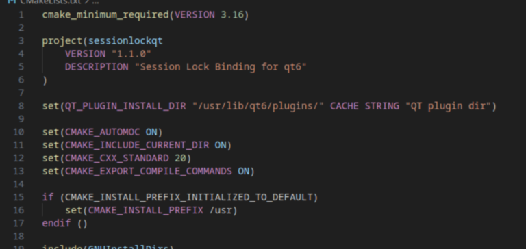
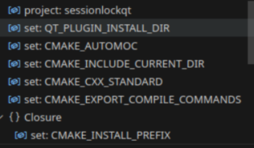

# neocmakelsp vscode plugin

This plugin is for [neocmakelsp](https://github.com/Decodetalkers/neocmakelsp) on vscode, it providing:

 - code completion
 - compile errors and warnings
 - go-to-definition and cross references
 - hover information
 - code formatting
 - highlight
 - AST tree

## Settings

neocmakelsp can use tcp way to start, and it can be set to use local target, not download asserts from github, you can set them like

```json
{
  "neocmakelsp": {
    "tcp": true,
    "localtarget": true
  }
}
```

NOTE: this feature only enable on unix system which has `nc` command.

## Feature show

### highlight



### Ast tree



### Hover


